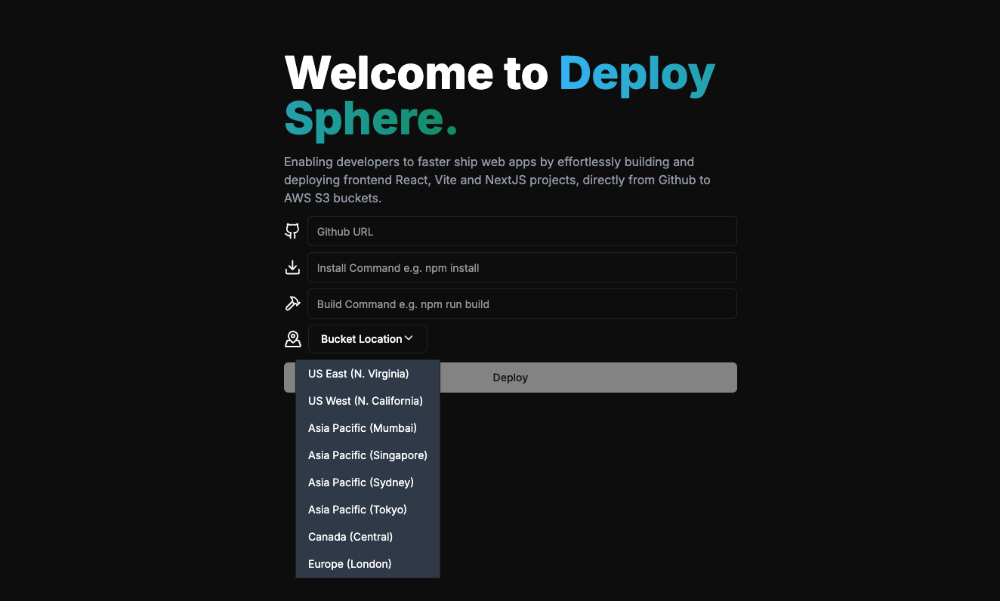
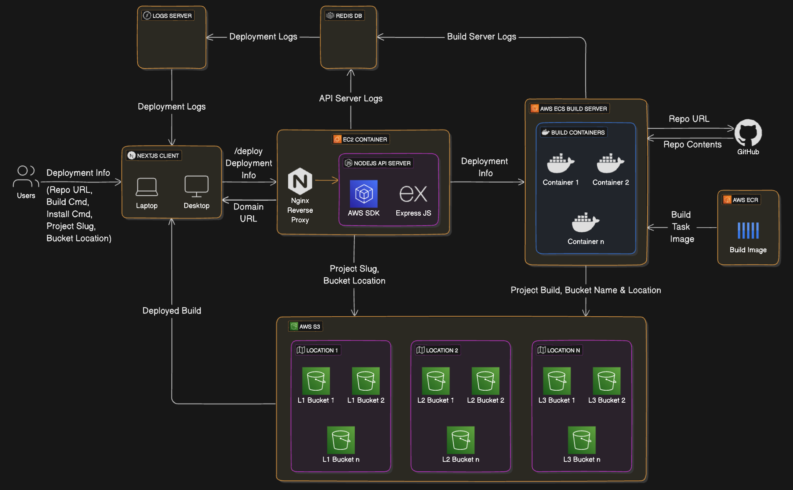

# Deploy Sphere

In today's digital landscape, developers often struggle with the complexities of deploying and scaling web applications, including manual processes, server management, and ensuring global performance. 

`Deploy Sphere` bridges this gap by providing a seamless workflow that integrates smoothly with popular frontend frameworks like Next.js and React. It automates deployment, scales effortlessly, and ensures fast delivery of web content, enabling developers to concentrate on coding without the burden of managing infrastructure.



## 📜 Working (Deployment Workflow)



1. The user enters the `deployment info` on the `Next.js Client`. It includes:

     - `Repo URL`: GitHub Repository URL containing the frontend files to be deployed. (e.g. `https://github.com/abhishek-x/sample-project`)
     - `Install Command`: Bash command to install the necessary packages and modules in the project. (e.g. `npm install`)
     - `Build Command`: Bash command to build the project (e.g. `npm run build`)
     - `Project Slug`: Project name for deployment, which will be used as a sub-domain for deployment URL
     - `Bucket Location`: Select the geographically nearest node for storing web content to reduce latency (Round Trip Time) by enabling geocaching on CDN (S3).

2. `Next.js Client` will send a REST API request through `Nginx Reverse Proxy` to the `API Server (Node.js and Express based)` provisioned on an `EC2 Instance`.

3. `API Server` will provision the asynchronously provision the cloud resources using `AWS SDK`:

     - It will provision an S3 bucket in the given `Bucket Location` with the given `Project Slug` as the bucket name.
     - Fetch our build image (`Dockerfile`) from `AWS ECR` and spin a build task container in `AWS Elastic Container Service (Build Server)` with the given `Deployment Info`.

4. Build Server will start the `Build Task`, which includes:

     - Spinning up a lightweight `Ubuntu OS` layer on the container and installing necessary packages.
     - Cloning the `GitHub Repo` on the container.
     - Run the `Install Command` to install the necessary packages and modules in the GitHub project.
     - Run the `Build Command` to compile, bundle, and optimize the source code of an application into a format that is ready for production deployment.
     - Push the built object to the provisioned S3 Bucket.

5. After completion of the Build Task, the API server will delete the build task from ECS (to reduce costs) and return the `Deployment URL` to the user as:

     ```
     http://<Project Slug>.s3-website.<Bucket Location>.amazonaws.com
     ```

## 🪵 Working (Real-time Logging Workflow)

1. Deployment logs will be collected from the `API Server` and `Build Server`, and pushed to a `WebSocket Server`.
2. Redis is used to temporarily store logs before they are processed or forwarded. It also serves as a caching layer for logs that need quick retrieval.
3. The `Next.js frontend` will subscribe to the Socket.IO channel to receive logs and display them in real time.

## 🔮 Future Work

1. **Persistent Storage** for deployment info into `PostgreSQL`.

    ```SQL
    CREATE TABLE deployments (
        deployment_id SERIAL PRIMARY KEY,
        git_url VARCHAR(255) UNIQUE NOT NULL,
        deployment_url VARCHAR(255) UNIQUE NOT NULL,
        project_slug VARCHAR(50) NOT NULL,
        bucket_location VARCHAR(50) NOT NULL,
        deployment_status VARCHAR(50) NOT NULL CHECK (deployment_status IN ('queued', 'building', 'ready', 'error', 'cancelled')),
        created_at TIMESTAMP DEFAULT CURRENT_TIMESTAMP,
        updated_at TIMESTAMP DEFAULT CURRENT_TIMESTAMP,
        UNIQUE (project_slug, bucket_location)
    );
    ```
2. **Real-time Log Analytics and Monitoring:**

    

    - Aggregate logs from `API Server and Build Server` into `Kafka Topics`.
    - `Logstash` will consume logs from Kafka, process them, and forward them to `Elasticsearch`.
    - `Elasticsearch` will store the logs, indexed for search and analysis.
    - `Kibana` will be used to visualise the logs, enabling search, filtering, and dashboard creation.
  
3. **Monitor the Performance Metrics of Servers:** Setup a Prometheus server to scrape metrics and use `Grafana` to monitor and visualise several KPIs like:

   - **Request Metrics:** Request rate, request duration/latency, error rate, request size, request throughput, etc.
   - **Resource Usage Metrics:** For CPU, memory and disk I/O.
   - **Availability Metrics:** Uptime, instance restart count and number of HTTP responses by status code


## 👥 Contributors

<table>
  <tr>
    <td align="center"><a href="https://github.com/abhishek-x"><br /><sub><b>Abhishek Aggarwal</b></sub></a><br /></td>
  </tr>
</table>
